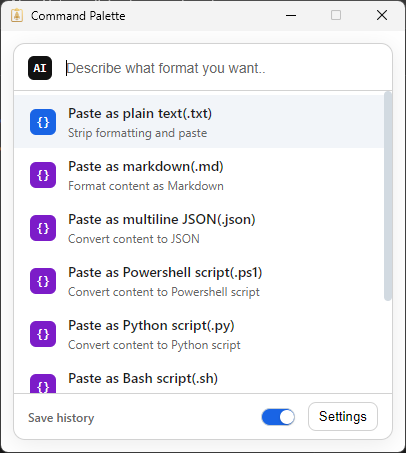
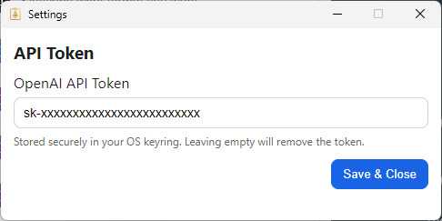
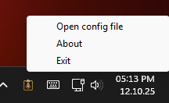

# BetterAdvancedPaste

An AI-powered “Advanced Paste” for Windows. Press Win+Shift+V in File Explorer to open a lightweight command palette that takes your current clipboard, applies your instruction (or a preset), and saves the AI-generated output to the active Explorer folder with a sensible filename. Inspired by [Powertoys](https://github.com/microsoft/PowerToys) advanced paste module

This was my hobby project since powertoys advanced paste only allowed openai endpoints, while I wished to use free endpoints online or llama cpp server

The python main project was made cross platform to be used like `python main.py folderpath` and it will show the gui and paste clipboard text like that. Its only the windows explorer hooking part of project that is preventing it from hitting linux and mac. However I am not thinking of expanding it to them or spend more time on this. Anyone who can do it are welcome.

## ✨ Features
- Global hotkey: Win+Shift+V to open the palette in the active Explorer window
- The small 73kb c/c++ exe is the one that checks for shortcut usage from tray, the main 13mb python program palette is called only when shortcut is used.
- Command palette UI (pywebview) with fast filtering and presets from `conf.json`
- “Type what you want” freeform instruction in the search bar
- Saves output file into the current Explorer folder and auto-closes on success
- Smart filename suggestion via AI with safe sanitization and correct extension
- Preset history: optionally store successful prompts into `conf.json` for reuse
- Settings popup to manage your OpenAI API token securely via OS keyring
- AI backends:
	- OpenAI-compatible API (if `use_openai` and token set)
	- Local model endpoint fallback at `http://127.0.0.1:8080/completion`
- Tray icon with right-click menu (Open config, About, Exit)
- Auto-start on login (adds HKCU\...\Run entry)
- The python software is fully cross platform. Only the c/c++ helper that detects explorer location is windows only.
# Screenshots


  
Stores and retrieves settings securely via keyring separated from conf.json file into system credentials.

  
Open config file to edit presets, add text icons, edit localhost url or edit service provider endpoint url

# Download
[Download from release](https://github.com/neptotech/BetterAdvancedPaste/releases/)

## How it works

There are two parts:

1) Python UI (pywebview) built into a standalone executable via PyInstaller.
	 - Binary name from this repo’s PyInstaller build is `BetterAdvancedPaste.exe`.
	 - It expects a single CLI argument: an output directory where the generated file will be saved.
	 - Its fully cross platform
	 - Example usage: `python main.py D:\`

2) Native Windows helper (C++/Win32).
	 - Stays resident in the tray, installs a low-level keyboard hook for Win+Shift+V.
	 - On hotkey, it resolves the active Explorer folder and launches `BetterAdvancedPasteCLI.exe "<that-folder>"`.
	 - For deployment, you should place the Python-built EXE next to the C++ EXE and name it `BetterAdvancedPasteCLI.exe` (see Deployment below).


## Configuration
>**NOTE:**
Everyone must edit the conf.json, change following entries: `endpoint`,`use_openai`, `model`, and inside win shift v menu edit setting pasting the key to be used with endpoint.   
Alternatively edit `local_url` to use llamacpp,lmstudio,ollama,etc. servers  

`conf.json` controls presets, settings, and AI options. Example (included):

```json
{
	"settings": { "save_history": false },
	"ai": {
		"use_openai": true,
		"model": "gpt-3.5-turbo",
		"endpoint": "https://api.chatanywhere.tech/v1/chat/completions",
		"local_url": "http://127.0.0.1:8080/completion"
	},
	"options": [
		{ "icon": "{}", "color": "#2563eb", "title": "Paste as plain text", "desc": "Strip formatting and paste" },
		{ "icon": "{}", "color": "#7e22ce", "title": "Paste as markdown",  "desc": "Format content as Markdown" },
		{ "icon": "{}", "color": "#7e22ce", "title": "Paste as multiline JSON", "desc": "Convert content to JSON" },
		{ "icon": "{}", "color": "#7e22ce", "title": "Paste as Powershell script", "desc": "Convert content to Powershell script" },
		{ "icon": "{}", "color": "#7e22ce", "title": "Paste as Python script", "desc": "Convert content to Python script" },
		{ "icon": "{}", "color": "#7e22ce", "title": "Paste as Bash script",   "desc": "Convert content to Bash script" },
		{ "icon": "{}", "color": "#7e22ce", "title": "Paste as HTML",          "desc": "Convert content to HTML" },
		{ "icon": "{}", "color": "#7e22ce", "title": "Paste as XML",           "desc": "Convert content to XML" }
	]
}
```
## Recommended local models
If you are gonna use llama-server I recommend the following models:
 - LiquidAI\LFM2-1.2B-GGUF\LFM2-1.2B-Q8_0.gguf
 - lmstudio-community\Qwen3-4B-Instruct-2507-GGUF\Qwen3-4B-Instruct-2507-Q4_K_M.gguf
 - ggml-org\SmolVLM2-2.2B-Instruct-GGUF\SmolVLM2-2.2B-Instruct-Q4_K_M.gguf  
 Prefer such small and powerful instruct models.  
 Start it like `llama-server -m "!MODEL_PATH!" --gpu-layers 999` and use the endpoint it starts in conf.json   
 Any amd or intel `igpu` would be powerful enough. Just make sure you have vulkan or such equivalent drivers to support llama use integrated gpu

## Build – Python app (PyInstaller)

Prereqs: Python 3.11+ (3.12 is OK), PowerShell, and optionally UPX in PATH for compression.

This repo includes a build script that creates a venv, installs deps, converts an icon if needed, and runs PyInstaller using `better_advanced_paste.spec`.

- With a PNG icon:

```powershell
pwsh -NoProfile -NonInteractive -ExecutionPolicy Bypass -File build.ps1 -Icon icon.png
```

- Or without icon (it will try `icon.ico` if present):

```powershell
pwsh -NoProfile -NonInteractive -ExecutionPolicy Bypass -File build.ps1
```

Outputs:

- `dist/BetterAdvancedPaste.exe` (also copied to the repo root for convenience)

Notes:

- The Python executable expects one argument: output directory where the AI result should be saved.
- For integration with the C++ helper, rename/copy the built EXE to `BetterAdvancedPasteCLI.exe` and place it next to the C++ tray app EXE (see Deployment).


## Build – C/C++ native helper (Win32)

Prereqs: Visual Studio 2022 with C++ Desktop workload and a recent Windows SDK.

Steps:

1. Open the solution filter: `BetterAdvancedPaste/BetterAdvancedPaste.slnx` in Visual Studio.
2. Select the `Release | x64` configuration.
3. Build. The tray app executable will be generated under `BetterAdvancedPaste/x64/Release/`.

What it does:

- Installs a low-level keyboard hook for Win+Shift+V
- Resolves the active File Explorer folder
- Launches `BetterAdvancedPasteCLI.exe "<folder>"` (expected in the same directory as the tray app)
- Adds a tray icon and a startup registry key under HKCU Run


## Deployment

Place these files side-by-side (same folder):

- `BetterAdvancedPaste.exe` (C++ tray app)
- `BetterAdvancedPasteCLI.exe` (Python UI – produced by the Python build, renamed)
- `conf.json` (your configuration)

Start the tray app(BetterAdvancedPaste.exe). Use Win+Shift+V in an Explorer window to open the palette.


## Usage tips
- Custom prompts are better if they mention the file extension they expect the output along with normal prompt stuff like   
>_replace all " with ' and save as .txt_
- Type an instruction in the palette (e.g., “format as Markdown”, “make a PowerShell script that…”) or select a preset.
- On success the app closes automatically and saves a file into the current folder.
- Toggle “Save history” to automatically append successful prompts to `conf.json` for reuse.
- Use the Settings button in the palette to set your OpenAI API token (stored in keyring).


## Troubleshooting

- No response or “AI request failed”: ensure your OpenAI token is configured (Settings) or your local endpoint at `127.0.0.1:8080/completion` is running.
- The palette doesn’t appear: verify the C++ tray app is running (tray icon visible) and you’re pressing Win+Shift+V in a File Explorer window.
- File not saved: ensure the Explorer window has a real filesystem folder in focus.


## Development
(Cross platform)
- Run UI without packaging (for quick dev):
	- `python main.py "C:\\Temp\\Output"`
- Edit presets in `conf.json`; they appear in the palette when the app starts.


## License

This project is licensed under the terms of the LICENSE file included in the repository.

